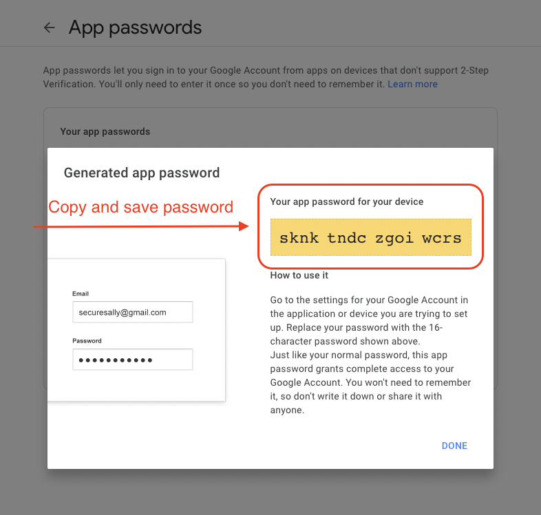

# <h1 style="text-align:center">Clinic Registration API</h1>

<hr style="height: 3px; background-color: rgba(255,118,38,0.84)">

## Overview

Spring Boot API for managing users, doctors, patients and their appointments.

---

## Pre-requisites

- Java 17
- Maven 3.x

---

## Build & Run


To run the project you need to perform following actions:

1. Replace `username` and `password` under **DB CONFIGS** section in `application.yaml`
2. Make sure that your **MySQL** local server is running and that `clinic_db` database exists.

```yaml
datasource:
  url: jdbc:mysql://${MYSQL_HOST:localhost}:3306/clinic_db
  username: // TODO - your db username
  password: // TODO - your password
```

3. If `clinic_db` does not exists please create it by running below query.

```mysql
CREATE DATABASE IF NOT EXISTS clinic_db;
```

5. Create new Gmail account or use your existing account to generate `App Password`.

- Enable 2-step verification in your gmail account under [security section](https://myaccount.google.com/u/0/security)
   or [here](https://myaccount.google.com/u/0/signinoptions/two-step-verification).


- Go to [2-Step Verification tab](https://myaccount.google.com/u/1/signinoptions/two-step-verification)
   or strait to [app passwords tab](https://myaccount.google.com/u/1/apppasswords) and create App password.





6. Replace `username` and `password` under **EMAIL CONFIGS** section in `application.yaml`

```yaml
mail:
  host: smtp.gmail.com
  port: 587
  username: // TODO - your email here
  password: // TODO - app password
  protocol: smtp
  properties:
    mail:
      smtp:
        auth: true
        starttls.enable: true
```

7. Run the project from Intellij IDEA or from terminal by runing bellow command:

```bash
# Make sure your in the root project directory and run:

./mvnw clean package -DskipTests && java -jar target/*.jar 
```

---

### Used tech

- Java 17
- Spring Web
- Spring Security
- Spring Data JPA
- Spring Mail
- SpringDoc Open API
- Maven
- MySQL
- H2 Database
- Flyway
- MapStruct
- Project Lombok
- Hibernate Validators

---
